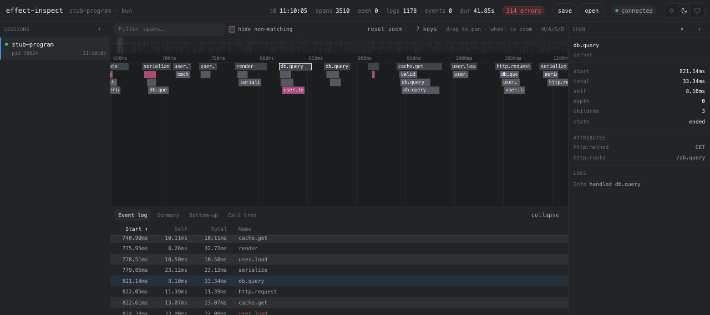

# effect-inspect

A performance inspector for Effect 4 programs. Add `Inspect.layer()` to your app
to view its spans in a live flame chart with events and logs, or query a run from
the command line.



## Quickstart

Install in your Effect 4 project. The CLI requires Node.js 22 or newer.

```bash
npm install effect-inspect effect
```

Start the collector, which receives traces from your app and serves the web UI:

```bash
npx effect-inspect start
# effect-inspect listening at http://localhost:34437
```

Open that URL and leave the collector running. Add the layer to your program,
then run it in another terminal:

```ts
import { Effect } from 'effect'
import { Inspect } from 'effect-inspect'

const program = Effect.gen(function* () {
  yield* Effect.sleep('50 millis')
}).pipe(Effect.withSpan('my-work'))

Effect.runPromise(program.pipe(Effect.provide(Inspect.layer())))
```

Select the run in the UI to inspect its flame chart and event log. Selecting a
span shows its attributes, events and failure details.

## Recording traces

`Inspect.layer()` installs a tracer and adds a logger alongside your existing
loggers. It records `Effect.withSpan`, `Effect.annotateCurrentSpan` and
`Effect.log*` without changing your console logging.

All layer options are optional:

```ts
Inspect.layer({
  url: 'ws://localhost:34437', // where the collector listens
  programName: 'my-service', // what the session list shows; defaults to the entry script's file name
  sessionId: 'checkout-before-1', // see "Choosing the session ID"; defaults to a random UUID
  bufferSize: 131072, // outbound queue, in messages (~34 MB at the measured mean)
})
```

If the collector is unavailable, your program keeps running. The inspector
reconnects in the background using the same session ID. When the outbound queue
fills, it drops new messages and reports the gap as a warning in the trace.

### Choosing the session ID

Runs get a random UUID by default. Choose an ID when you want to find a specific
run from a script or coding agent:

```bash
EFFECT_INSPECT_SESSION_ID=checkout-before-1 bun my-program.ts
```

The `sessionId` layer option takes precedence over the environment variable.
Use a fresh ID for each run, retry and instrumented child process. Reconnects
keep the same ID, but a second run using an ID already held by the collector
creates a conflict: the collector discards the second run's telemetry, keeps
the original trace and records the collision in its `conflicts` count. CLI
queries for that ID fail with `SessionConflict`.

IDs must contain 1 to 128 ASCII letters, digits, `.`, `_` or `-`, and start with
a letter or digit. An invalid ID or an empty environment variable disables
recording and logs a warning. Remove the variable to return to random IDs.
Child processes inherit it, so give each instrumented child its own value or
remove the variable from its environment.

Under Deno, grant `--allow-env=EFFECT_INSPECT_SESSION_ID` or pass the `sessionId`
option. If environment access is denied, the layer disables recording with a
warning. Browsers and other runtimes without an environment use a random UUID.

## Querying runs from the command line

Choose a session ID before launching your app, then use it to query that run:

```bash
npx effect-inspect start                                   # terminal 1, leave running
EFFECT_INSPECT_SESSION_ID=checkout-fail-001 bun my-program.ts
npx effect-inspect summary --session checkout-fail-001 --json
npx effect-inspect spans   --session checkout-fail-001 --status failed --json
npx effect-inspect span    --session checkout-fail-001 --span SPAN_ID --json
npx effect-inspect logs    --session checkout-fail-001 --span SPAN_ID --json
npx effect-inspect export  --session checkout-fail-001 --out checkout-fail-001.eitrace --json
npx effect-inspect summary --file checkout-fail-001.eitrace --json   # no collector needed
```

Start with `summary` for an overview, use `spans` to find failures or long-running
spans, then inspect a span and its logs. Use `sessions` to list runs when you
don't know their IDs.

Queries use `--session` for a live collector or `--file` for a saved trace.
Each command writes one JSON document to stdout, limited to 1 MiB, and writes
failure diagnostics to stderr. Each outcome has a distinct exit code.
`--json` produces compact output for scripts.

The collector address comes from `--url`, then `EFFECT_INSPECT_PORT`, with
`http://localhost:34437` as the default. Run `npx effect-inspect --help` or
`npx effect-inspect <command> --help` for flags, output fields and error codes.
Span durations measure elapsed time, not CPU usage.

## Saving and loading traces

Click **save** in the UI header to download the selected session as a `.eitrace`
file. Click **open** or drop a file onto the page to load it. Loaded traces appear
in the session list marked `file`, with the same chart, filters and detail panels
as live runs. You can also query saved files with the CLI's `--file` option.

The collector keeps traces in memory. Restarting your app leaves its previous
runs available; stopping the collector clears them. Save or export any traces
you want to keep before stopping it.

A `.eitrace` file contains the recorded protocol messages as JSON lines and a
header with the session's clock. Saved traces can be shared and inspected
offline. Saving a loaded trace preserves its recorded data.

## Configuration

| Variable                  | Default  | Effect                                 |
| ------------------------- | -------- | -------------------------------------- |
| `EFFECT_INSPECT_PORT`     | `34437`  | Port the collector listens on          |
| `EFFECT_INSPECT_CAPACITY` | `200000` | Messages the collector retains per run |

The collector serves the web UI and WebSocket connections on the same port.
Programs connect to `ws://localhost:34437/`; the UI connects to
`ws://localhost:34437/webapp`.

If you change the collector port, pass the matching `url` to `Inspect.layer()`.
The layer does not read `EFFECT_INSPECT_PORT`.

The layer uses the runtime's global `WebSocket`. If your runtime doesn't provide
one, use `Inspect.layerWebSocket()` with an Effect WebSocket constructor.

## Development

Use Bun to work on the repository:

```bash
bun install
bun run collector    # collector on port 34437
bun run dev:app      # UI at http://localhost:34438, in another terminal
bun run example:webapp  # sample trace, in a third terminal
```

See [`examples/README.md`](examples/README.md) for programs covering concurrency,
failures, deep traces and high message volumes.

The frontend uses [Foldkit](https://foldkit.dev/), Effect 4 and Vite.
`app/src/main.ts` defines initialization and updates, and
`app/src/state/model.ts` defines the UI model. Browser actions live in Commands,
the collector connection in a scoped Subscription, and canvas rendering and
listeners in scoped Mounts.

`TraceStore` holds span data outside the UI model. Socket messages update it
directly; the UI samples changes once per animation frame. The event log is
virtualized, and aggregation uses the chart's sampled time window. DevTools uses
Inspect mode because the mutable trace store does not support historical replay.
Reloads preserve UI preferences, but loaded trace files must be reopened.

Vite proxies `/webapp` to the local collector on port 34437. Set
`VITE_COLLECTOR_URL` to connect the development UI to another collector.
`bun run build` compiles the CLI and builds the frontend into `app/dist`, which
the installed CLI serves as static assets.

```bash
bun run check         # format, lint, typecheck; required before committing
bun run check:write   # apply formatting and lint fixes
bun test src app      # tests
bun run stub:collector  # fake collector for frontend development
```
